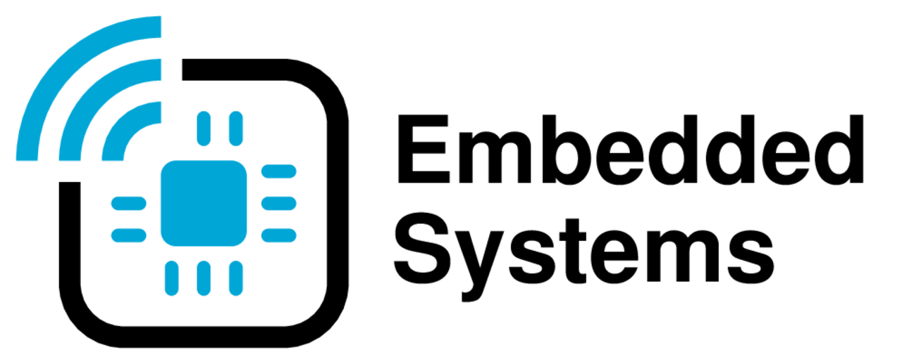

# TU Delft ENS Group Logo Template

This is a official repository for [TU Delft Embedded Systems Group](http://www.es.ewi.tudelft.nl) logo, which you can see below.



### How to use this template

Assuming you have LaTeX and [ImageMagick](https://imagemagick.org/) installed and any Unix-compatible system, simply type

```
./compile-all-tud-es-logo.sh 
```

This will compile the whole set of logos hosted in the respective repositories.

### Structure of this repository

_Folders_:

- `tud-es-logo-black`: Black and white version of the logo (in PDF, PS and PNG {in three sizes of 16:9 ratio})
- `tud-es-logo-black-notext`: Black and white version of the logo, without "Embedded Systems" text (in PDF, PS and PNG {in three sizes of 16:9 ratio})
- `tud-es-logo-color`: Color version of the logo (in PDF, PS, PNG {in three sizes of 16:9 ratio} and animated GIF)
- `tud-es-logo-color-notext`: Color version of the logo, without "Embedded Systems" text (in PDF, PS, PNG {in three sizes of 16:9 ratio} and animated GIF)
- `tud-es-logo-tikz`: source files of TU Delft ENS logo defined in TikZ

_Files_:

- `compile-all-tud-es-logo.sh`: scrip to generate all logos automatically from a TikZ definition of a logo
- `README.md`: this file
- `LICENCE`: license file

### History

The logo was created by [Casper Dennis van Wezel](https://github.com/12casper3/). This repository is its cleaned and revised copy of his original logo repository.

### Copyright

Copyright (C) 2022 TU Delft Embedded Systems Group and Casper van Wezel.

MIT Licence. See [License](https://github.com/TUDSSL/TUD_ENS_MSc_Thesis_Template/blob/master/LICENSE) file for details.